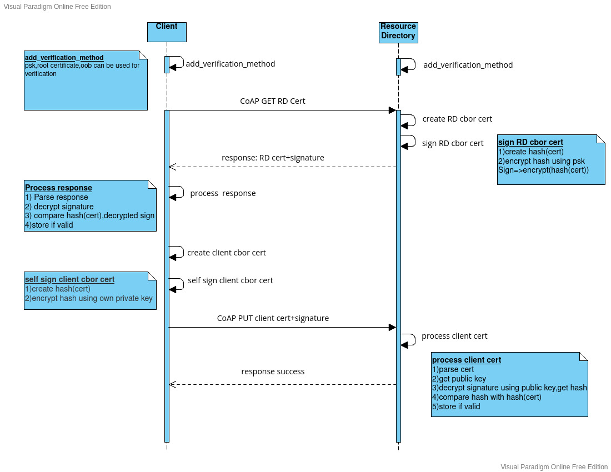

# **client registration with resource directory**

## about
The project is part of [DoRIoT](http://doriot.net/) and contains the source code exchanging certificates between a client and a resource directory(rd).

### folder structure

-**doriot_wot** contains 2 modules,one for client(**doriot_wot_cl**) and one for resource directory(**doriot_wot_rd**).

-**examples** folder contains example application for client and resouce directory.

the certificate exchange for registering a client with rd,happens as per the sequence diagram below.

Applications can be tested with native instances of riot,and communicating via tap interface. 

## Usage

- Create two or more(if needed) tap interfaces by "./dist/tools/tapsetup/tapsetup --create 2"

- set **RIOTBASE** properly in makefile and build client and rd applications in examples

- enter "help" to see the availbe commands

- On rd terminal,start rd by using the command "wotrd start"

- note the ip address of rd using "ifconfig" command

- on client terminal,type "wotc -r ip_address_of_rd"

- client and resource directory exchanges certificates, and are stored in list.

- To check,If the certficate is stored,type "wotf alice" in rd terminal.(alice is the default name for the client)

	

