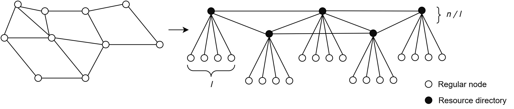
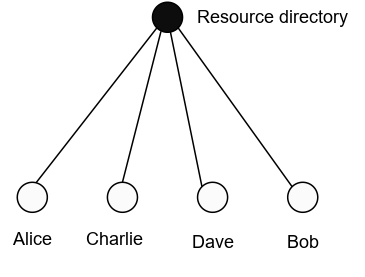
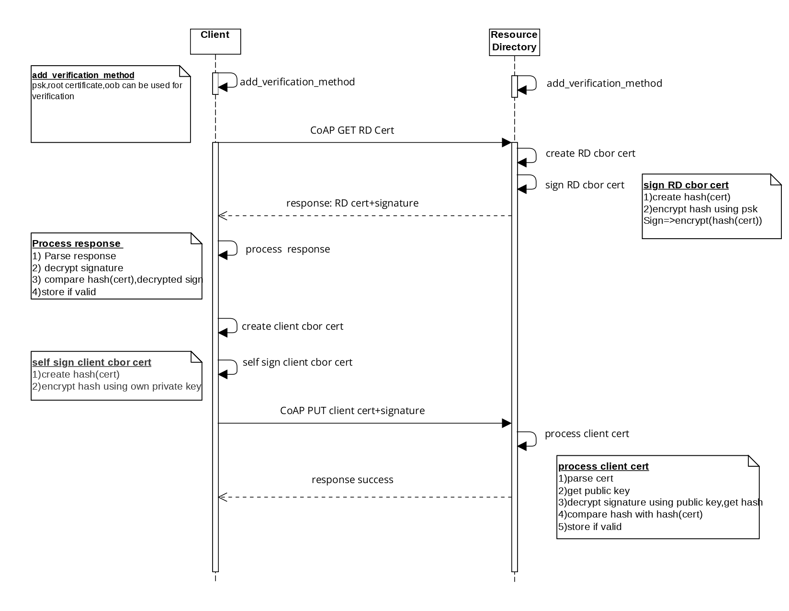
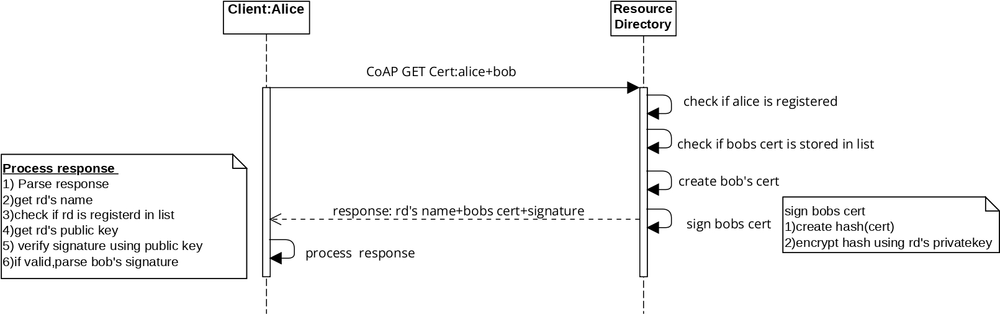

# **Concept for a  Web-of-Trust-based certificate management in RIOT OS**

## about
The project is part of [DoRIoT](http://doriot.net/).
Most Internet of Things (IoT) platforms are cloud-based, and devices must be registered and managed centrally via the cloud interface. This means that certificates for authentication must be stored and managed centrally by a web interface that is a single point of failure in case of an attack. To avoid this issue, Web of Trust-based approaches can be used.The project is regarding the implementation of a certificate chain discovery protocol,based on the Web of Trust and is implemented as a module for RIOT OS.

## Concept
CoAP resource directories are introduces in the network,which provides a service for storing the digital certificates of nodes in the network.
A semistructures heirarchial network topology based on WoT is formed as shown below.

When a new node enters the network, it goes through the following steps. 
 
 1. Node finds and registers with the resource directory 

 2. Node authenticates the resource directory and establishes trust. This is similar to Key signing in WoT. This can be done with hard coded PSK or root certificate. Also, Out of Band methods can also be used.  

 3. Resource directory stores the valid public key of the new node, and node stores the public key of the resource directory after trust establishment. The resource directory has the list of public keys of all registered nodes, while the node just needs to store the public key of the resource directory. 

 4. When a node wants to communicate with another node, it queries the resource directory for the public key of the desired node. 
      
 5. The node must verify the certificate chain of the peer node before communication. This process is called certificate chain discovery. 
    
 6. Nodes can now use the public key to secure the communication.

The current implementation supports a subpart of the topology as shown below,which contains a single resouce directory with multiple clients connected to it

The implementation mainly consists of two mechanisms
 1. Registration mechanism - clients registers with the resource directory
 2. Look up mechanis - Clients looks up the certificate of other clients in resource directory
 
 The sequence diagram of registration mechanism is as shown below
 
 
 
  The sequence diagram of lookup mechanism is as shown below
 
 

### Folder structure

-**doriot_wot** contains 2 modules,one for client(**doriot_wot_cl**) and one for resource directory(**doriot_wot_rd**).

-**examples** folder contains example application for client and resouce directory.

## Usage-Example applications

- set **RIOTBASE** properly in makefile,build and flash client and rd applications.

- Enter "help" to see the availbe commands

- On rd terminal,start rd by using the command : "rd start"

- clients finds the resource directory using CoAP resource discovery: "client -d" 

- clients registers with the resource directory by exchanging certificates: "client -r" 

- client and resource directory exchanges certificates, and are stored in list.

- When alice wants to get the certificate of bob from resource directory,make a look up request: "client -l bob" 

	

